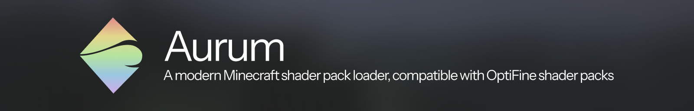

# Aurum

A modern Minecraft shader pack loader, compatible with OptiFine shader packs

## Download

We have no published releases of the mod right now. The only way you can get an artifact is via the experimental CI builds.

[Click here to download the latest nightly](https://nightly.link/LilithTechnologies/Aurum/workflows/build-commit/master/aurum-artifacts-master.zip).

## What's the current state of development?

Aurum has public releases for the latest version of Minecraft that work with the official releases of Argentum. Aurum is generally usable on most shader packs,
however, Argentum is still not complete software. Performance can be improved, and more features are being added for shader developers. There are also some minor missing features from OptiFine that make the implementation incomplete.

Aurum has various incompatibilities with shaders, which will be solved in the coming days. Currently, shaders like Complementary, BSL and Rethinking Voxels work mostly fine while shaders like Photon break Aurum.

## How can I help?

* Code review on open PRs is appreciated! This helps get important issues with PRs resolved before I give them a look.
* Code contributions through PRs are also welcome! If you're working on a large / significant feature it's usually a good idea to talk about your plans beforehand, to make sure that work isn't wasted.
z`
## Credits

* **coderbot19, IMS and other Iris contributors**, for creating Iris
* **rhysdh540**, for creating Argentum; the sodium counterpart of Aurum
* **TheOnlyThing and Vaerian**, for creating the excellent logo
* **Mumfrey**, for creating the Mixin bytecode patching system used by Iris and Sodium internally
* **The Fabric and Quilt projects**, for enabling the existence of mods like Iris that make many patches to the game
* **JellySquid**, for creating Sodium, the best rendering optimization mod for Minecraft that currently exists, and for making it open-source
* **All past, present, and future contributors to Iris**, for helping the project move along
* **Dr. Rubisco**, for maintaining the website
* **The Iris support and moderation team**, for handling user support requests and allowing the Iris maintainers to focus on developing Iris
* **daxnitro, karyonix, and sp614x**, for creating and maintaining the current shaders mods

## License

All code in this (Aurum) repository is completely free and open source, and you are free to read, distribute, and modify the code as long as you abide by the (fairly reasonable) terms of the [GNU LGPLv3 license](/LICENSE.md).

The source code of Aurum is derived from Iris. The following changes were made to it:
- Port from 1.16.5 to 1.8.9
- Back port various features like SSBOs, Custom Images and other modern Iris features
- Port to use the Celeritas renderer over Sodium
- Refactor and clean up the codebase to be much more readable and maintainable